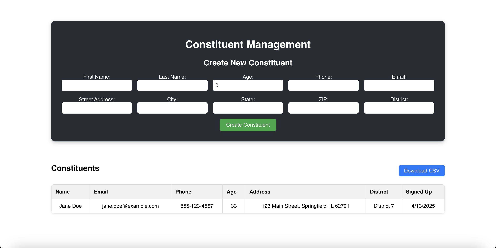

# Constituent App



A full-stack application with:
- PostgreSQL database
- Express backend with TypeScript
- React frontend with TypeScript
- Fully dockerized development and production environments

## Project Structure
```
./
├── client/                     # React frontend
│   ├── Dockerfile              # Production Docker configuration
│   └── Dockerfile.dev          # Development Docker configuration
├── server/                     # Express backend
│   ├── Dockerfile              # Production Docker configuration
│   └── Dockerfile.dev          # Development Docker configuration
├── db/                         # Database files
│   └── init/                   # Database initialization scripts
│       └── 01-init.sql         # Initial schema and data
├── docker-compose.yaml         # Production Docker configuration
├── docker-compose.dev.yaml     # Development Docker configuration
├── INSTRUCTIONS.md             # Instructions
└── README.md                   # This file
```

## Getting Started

### Prerequisites
- [Docker](https://www.docker.com/products/docker-desktop) and Docker Compose
- [Node.js](https://nodejs.org/) and npm (optional, for local development)

### Development With Docker

Start the development environment with hot-reloading:

```bash
docker-compose -f docker-compose.dev.yml up
```

### Production With Docker

Start the production environment:

```bash
docker-compose up -d
```

### Development Without Docker

#### Backend
```bash
cd server
npm install
npm run dev
```

#### Frontend
```bash
cd client
npm install
npm start
```

### Access

#### Development Environment
- Frontend: http://localhost:3000
- Backend API: http://localhost:8080/api
- PostgreSQL: localhost:5432

#### Production Environment
- Frontend: http://localhost
- Backend API: http://localhost/api
- PostgreSQL: localhost:5432

## Database

### Connection Details
- Host: localhost
- Port: 5432
- Database: postgres
- User: postgres
- Password: postgres

### Database Initialization

The database is automatically initialized with the scripts in the `db/init` directory when the container is first started.

## Docker Commands

### View Container Status
```bash
docker-compose ps
```

### View Logs
```bash
docker-compose logs -f
```

### Stop Containers
```bash
docker-compose down
```

### Rebuild Containers
```bash
docker-compose up --build
```

## API Routes

- `GET /api/` - Server status
- `GET /api/users` - List all users

## Project Structure Details

### Client
The React frontend is built with TypeScript and communicates with the Express backend via API calls.

### Server
The Express backend is built with TypeScript and connects to the PostgreSQL database.

### Database
PostgreSQL stores the application data in a persistent Docker volume.
